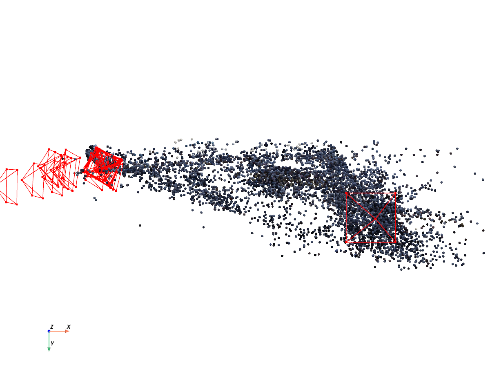
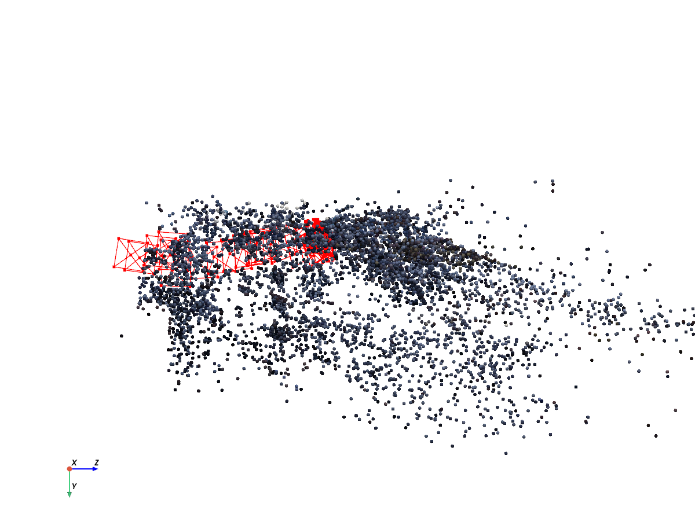
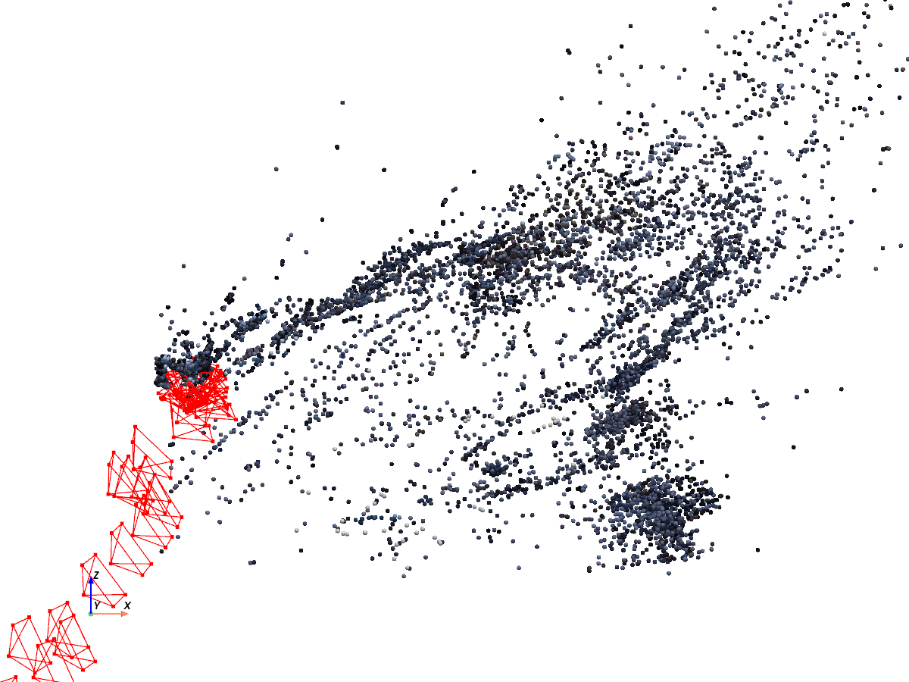
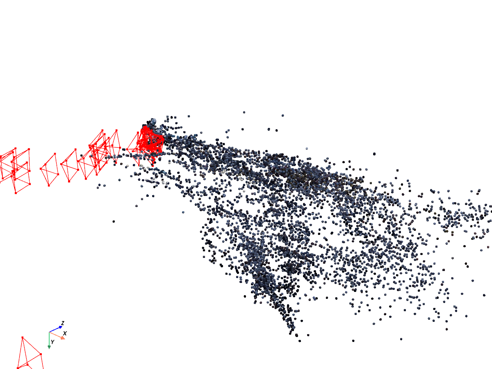
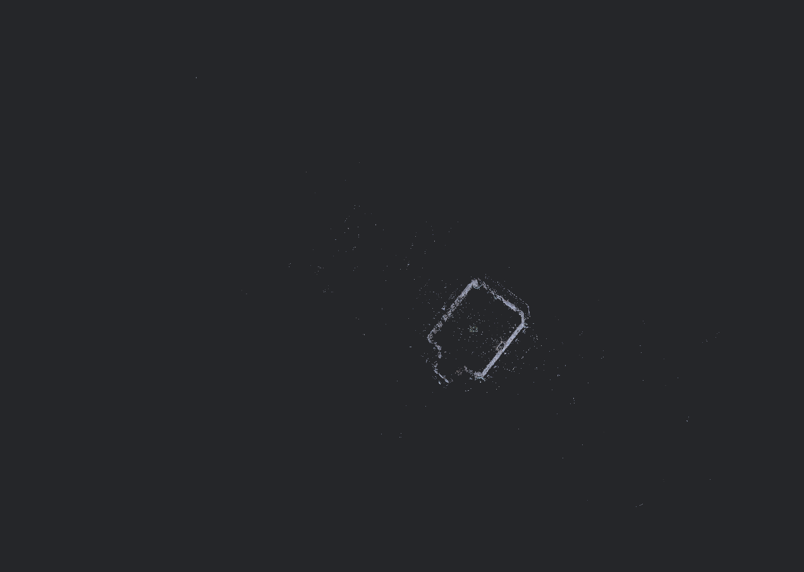

# SfM Tractor

A **from-scratch Structure-from-Motion pipeline** that reconstructs a sparse 3D point cloud of a John Deere tractor from 30 internet-sourced 2D photos. Written in Python on top of NumPy, SciPy, OpenCV primitives (SIFT, BFMatcher), and PyVista — the epipolar geometry, RANSAC, DLT triangulation, and sparse bundle adjustment are implemented in visible code, not called as black boxes.

A COLMAP wrapper (`run_colmap.py`) ships alongside as a production baseline for comparison.

## Headline numbers

Last full run on 30 images (see `Results` below):

| Metric | Value |
|---|---|
| Cameras registered | **30 / 30** (0 skipped) |
| Triangulated 3D points | **10,833** raw → 10,395 after outlier filter |
| Reprojection RMSE | **1.78 px → 1.39 px** after bundle adjustment (22% reduction) |
| Bundle adjustment | 25,599 observations, 32,673 free parameters, ~27 s |

## Architecture

Everything the pipeline needs lives in the `sfm/` package. Each module is small enough to read end-to-end:

| Module | Responsibility |
|---|---|
| `sfm/io_utils.py` | Load images, list an image directory, estimate intrinsics `K` from image dimensions, write colored `.ply` clouds. |
| `sfm/features.py` | SIFT detection, Lowe-ratio brute-force matching, match visualization for debugging. |
| `sfm/geometry.py` | From-scratch **normalized 8-point** fundamental matrix, RANSAC with Sampson distance and adaptive iteration count, `E = KᵀFK`. The pipeline uses `cv2.findEssentialMat` (Nister 5-point) for accuracy — the from-scratch 8-point stays as an educational comparison in the demo. Pose recovery via `cv2.recoverPose` (cheirality bookkeeping). |
| `sfm/triangulation.py` | **DLT triangulation** from scratch (4×4 SVD per point), reprojection error, cheirality check, per-point color sampling. |
| `sfm/pipeline.py` | `Reconstruction` dataclass + incremental SfM: `initialize_pair` bootstraps the world frame from images 0 and 1; `add_image` matches image *i* against *i−1*, runs `solvePnPRansac` on already-triangulated features to lock in the new pose, then triangulates the remaining matches. |
| `sfm/bundle_adjustment.py` | Sparse global refinement via `scipy.optimize.least_squares` with an explicit Jacobian sparsity pattern. Camera 0 is fixed to remove gauge ambiguity; all other camera poses and 3D points are jointly optimized against every 2D observation. |
| `sfm/viewer.py` | PyVista interactive viewer, offscreen 4-view screenshots (front / side / top / perspective), percentile-based outlier filter. |

Three standalone demos build the pipeline up one stage at a time:

- `demo_features.py` — SIFT + matching visualization on one image pair.
- `demo_geometry.py` — from-scratch 8-point F + RANSAC, compared numerically against `cv2.findFundamentalMat`.
- `demo_triangulation.py` — full two-view pair to first `.ply`.

## Results

Screenshots rendered by `sfm/viewer.py` (offscreen PyVista) from the sparse cloud after bundle adjustment.

Standard views:

| Front | Side | Top | Perspective |
|---|---|---|---|
|  |  |  |  |

Full sparse cloud. The courtyard walls resolve into a clean rectangular
footprint; the tractor at centre is sparse by comparison — see
[Analysis](#analysis--where-classical-sfm-runs-out-of-runway).



The same reconstruction, wider zoom.


## Analysis — where classical SfM runs out of runway

The reconstruction succeeds on the courtyard background but the **tractor itself reconstructs poorly** — the "Ghost Tractor" failure mode. This is a case study in the assumptions classical SfM quietly relies on, not a bug in the code.

**1. Specular green paint breaks SIFT's appearance-consistency assumption.**
SIFT (and every descriptor built on gradient histograms) assumes a feature looks approximately the same from viewpoints separated by moderate baselines. That is a *Lambertian* assumption — diffuse surfaces re-radiate light identically in every direction. Specular surfaces don't: highlights are view-dependent, so the "same" point on the paint produces different gradient patterns from adjacent cameras. Descriptors that should match don't, so Lowe's ratio test discards them and the tractor body ends up starved of correspondences.

**2. The glass cabin destroys the single-depth assumption per pixel.**
Every triangulation step assumes a matched pixel corresponds to a single 3D surface point. A transparent cabin window is two surfaces at different depths blended into one pixel, plus a refracted view of what's behind. Any feature the matcher accepts there is triangulated to an inconsistent depth and gets filtered as a cheirality or reprojection outlier.

**3. Where matches survive, they're on the matte brick walls and ground.**
Those surfaces satisfy the Lambertian assumption cleanly. The reconstructed cloud is dense over the environment and sparse over the object we actually care about — the opposite of what a naive user would expect from "photos of a tractor."

The honest takeaway is that classical multi-view geometry is a photometric method masquerading as a geometric one. Making a shiny, partly transparent object reconstruct well pushes you toward methods that don't rely on static appearance patches — photometric stereo with controlled lighting, active depth sensors, or learned neural fields (NeRF / Gaussian Splatting) that model view-dependent radiance explicitly. Each is a different tool for a different failure surface.

## Setup

Python 3.11+ (developed on 3.13). Install into a virtualenv:

```bash
python3 -m venv .venv
source .venv/bin/activate
pip install -r requirements.txt

```


### Images


The 30 input images are sourced from the web and are not redistributed
here. `samples/` contains 5 frames for reference.

To run the full pipeline, supply your own sequence: 20–40 photos of a
single rigid object, shot in one session, walking around it with heavy
overlap between consecutive frames. Name them lexically in shooting
order — `add_image` registers each frame against the previous one.
Drop them in `images/`.

## Usage

Full from-scratch reconstruction — this is the headline command:

```bash
python3 run_sfm.py --refine --screenshots      # reconstruct, bundle adjust, save 4-view PNGs
python3 run_sfm.py --refine --show             # + open the interactive PyVista window
```

Outputs land in `output/`:

- `tractor_sparse.ply` — the colored 3D point cloud
- `reconstruction.pkl` — pickled `Reconstruction` (cameras + observations) for re-analysis
- `views/{front,side,top,perspective}.png` — standard-view screenshots

Step-by-step demos on the sample pair:

```bash
python3 demo_features.py            # SIFT + matches side-by-side
python3 demo_geometry.py            # 8-point F + RANSAC vs OpenCV
python3 demo_triangulation.py       # first triangulated cloud
```

### COLMAP baseline (secondary)

`run_colmap.py` wraps the COLMAP CLI as a black-box reference to compare against. Requires COLMAP installed separately (`brew install colmap` on macOS).

```bash
python3 run_colmap.py
```

The point of this project is the from-scratch pipeline; COLMAP is kept only as a sanity benchmark.
