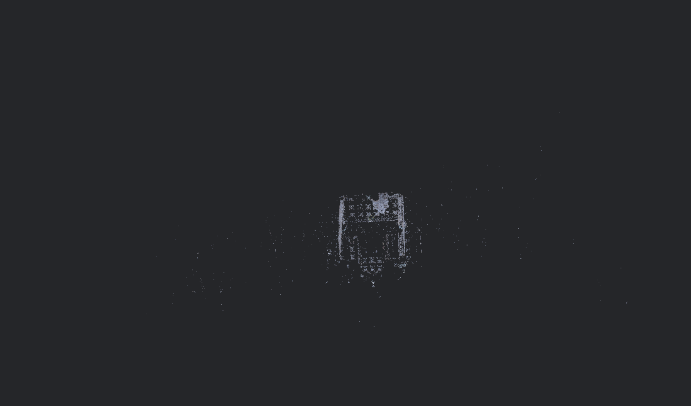
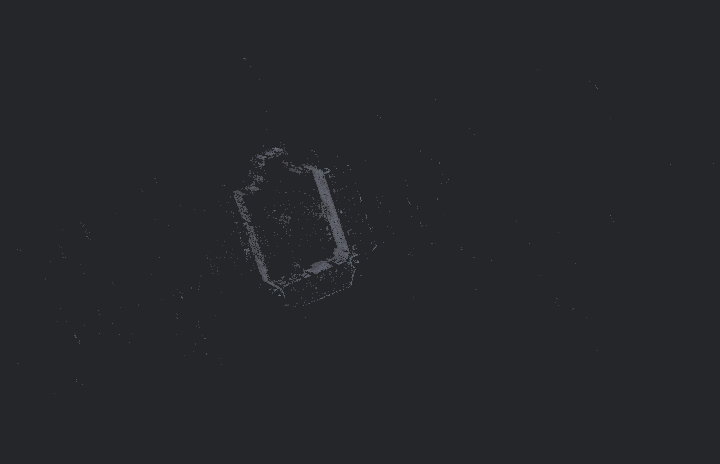

# 🚜 Automated Structure-from-Motion (SfM) Pipeline

An automated Python tool built to process 2D image datasets into 3D point clouds using the **COLMAP** engine. This project streamlines the photogrammetry workflow on macOS by managing database creation, feature extraction, and sparse reconstruction programmatically.

## 🎯 Project Overview
The goal of this project was to reconstruct a 3D model of a John Deere tractor from a set of 40 static images. It serves as a case study in how SfM algorithms handle complex, reflective industrial surfaces.

## 📂 Repository Structure
* `run_colmap.py`: The core automation script (Python).
* `images/`: The source dataset (40 JPG images of the tractor).
* `assets/`: Contains visualization screenshots of the output.
* `.gitignore`: Configured to prevent heavy `workspace` files from bloating the repo.

## 🚀 Technical Implementation
The pipeline follows a standard SfM workflow:
1. **Feature Extraction:** Utilizing SIFT to identify stable points across images.
2. **Feature Matching:** Exhaustive matching to find correspondences.
3. **Structure-from-Motion:** Triangulating points to create a sparse 3D cloud.

## 📊 Result & Analysis: The "Ghost" Artifact
The reconstruction successfully mapped the environment (matte brick walls and ground) but struggled with the subject (the tractor).

### Visual Results
| Environment Success | The "Ghost" Tractor |
| :---: | :---: |
|  |  |

### Why did the tractor disappear?
1. **Surface Specularity:** The glossy green paint of the tractor hood creates shifting reflections. SIFT features rely on static patterns; when reflections move, the algorithm discards those points as "noise."
2. **Transparency:** The glass cabin allows the background to be seen through it, confusing the depth estimation and leading to a "hollow" cabin.
3. **Hardware Constraint:** As this was processed on macOS (Non-CUDA), the pipeline was limited to **Sparse Reconstruction**. A Dense MVS (Multi-View Stereo) pass on an NVIDIA-based system would be required to fill the gaps.

## 🛠️ How to Run
1. Install COLMAP: `brew install colmap`
2. Clone this repo: `git clone https://github.com/YOUR_USERNAME/sfm-python-pipeline.git`
3. Execute: `python3 run_colmap.py`